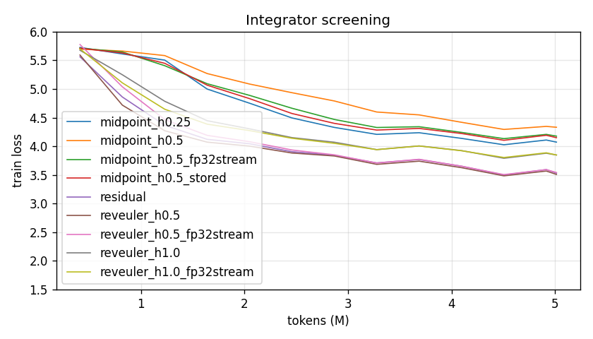
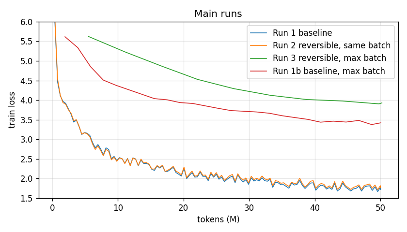
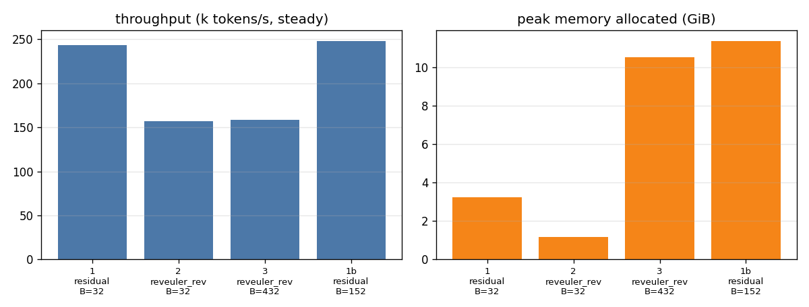

# Results (auto-generated by make_report.py)

## Integrator screening (5M tokens, batch 32)

| run | trunk | h | stream | batch | steps | final train loss | val loss | tokens/s | tokens/s (steady) | peak mem (GiB) | recon err |
|---|---|---|---|---|---|---|---|---|---|---|---|
| midpoint_h0.25 | midpoint_rev | 0.25 | fp64 | 32 | 306 | 4.760 | 4.132 | 158,093 | 159,536 | 1.38 | 0.0e+00 | GeForce RTX 5070 Ti |
| midpoint_h0.5 | midpoint_rev | 0.5 | fp64 | 32 | 306 | 4.959 | 4.379 | 157,798 | 159,520 | 1.38 | 0.0e+00 | GeForce RTX 5070 Ti |
| midpoint_h0.5_fp32stream | midpoint_rev | 0.5 | fp32 | 32 | 306 | 4.828 | 4.235 | 197,461 | 199,902 | 1.31 | 1.7e-01 | GeForce RTX 5070 Ti |
| midpoint_h0.5_stored | midpoint | 0.5 | fp32 | 32 | 306 | 4.805 | 4.210 | 239,862 | 243,082 | 3.22 | — | GeForce RTX 5070 Ti |
| residual | residual | — | fp32 | 32 | 306 | 4.293 | 3.624 | 241,361 | 244,633 | 3.22 | — | GeForce RTX 5070 Ti |
| reveuler_h0.5 | reveuler_rev | 0.5 | fp64 | 32 | 306 | 4.278 | 3.601 | 154,130 | 155,296 | 1.16 | 0.0e+00 | GeForce RTX 5070 Ti |
| reveuler_h0.5_fp32stream | reveuler_rev | 0.5 | fp32 | 32 | 306 | 4.370 | 3.630 | 193,270 | 195,281 | 1.11 | 1.2e-01 | GeForce RTX 5070 Ti |
| reveuler_h1.0 | reveuler_rev | 1.0 | fp64 | 32 | 306 | 4.530 | 3.912 | 154,807 | 156,191 | 1.16 | 0.0e+00 | GeForce RTX 5070 Ti |
| reveuler_h1.0_fp32stream | reveuler_rev | 1.0 | fp32 | 32 | 306 | 4.523 | 3.920 | 193,188 | 195,178 | 1.11 | 8.3e-01 | GeForce RTX 5070 Ti |

## Main runs (50M tokens)

| run | trunk | h | stream | batch | steps | final train loss | val loss | tokens/s | tokens/s (steady) | peak mem (GiB) | recon err |
|---|---|---|---|---|---|---|---|---|---|---|---|
| Run 1 baseline | residual | — | fp32 | 32 | 3052 | 1.761 | 1.849 | 242,954 | 243,278 | 3.22 | — | GeForce RTX 5070 Ti |
| Run 2 reversible, same batch | reveuler_rev | 0.5 | fp64 | 32 | 3052 | 1.804 | 1.890 | 156,838 | 156,965 | 1.16 | 0.0e+00 | GeForce RTX 5070 Ti |
| Run 3 reversible, max batch | reveuler_rev | 0.5 | fp64 | 432 | 227 | 4.760 | 3.970 | 158,143 | 158,349 | 10.51 | 0.0e+00 | GeForce RTX 5070 Ti |
| Run 1b baseline, max batch | residual | — | fp32 | 152 | 643 | 3.768 | 3.442 | 247,486 | 247,824 | 11.35 | — | GeForce RTX 5070 Ti |

## Headline numbers

- Peak memory at equal batch: 3.22 → 1.16 GiB (**64% lower**)
- Throughput at equal batch: 243,278 → 156,965 tok/s (**35% slower**)
- Reversible at max batch 432: 158,349 tok/s = **65% of baseline** throughput, peak 10.51 GiB
- Val loss: baseline 1.849, rev same-batch 1.890, rev max-batch 3.970
- Baseline at its own max batch 152: 247,824 tok/s, val 3.442, peak 11.35 GiB

## Max batch probes (13.5 GiB budget)

- residual (stream fp32): **152**
- reveuler_rev (stream fp32): **640**
- reveuler_rev (stream fp64): **432**
